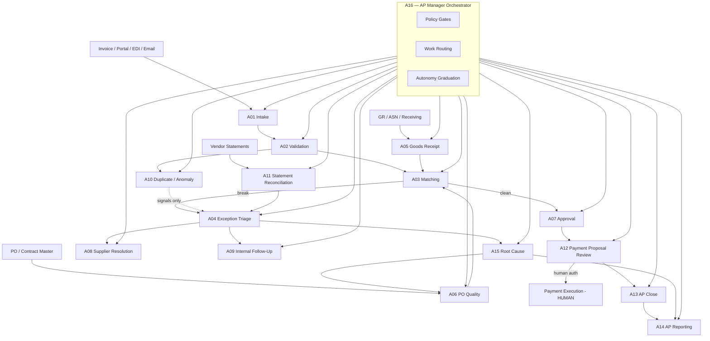

# AP Agent Stack Overview

**Product:** Evidence Room — AP Agent OS Pro  
**Scope:** 16-agent operating architecture for Accounts Payable  
**Principle:** Agents earn responsibility; humans retain payment authority and material judgment.

---

## What this stack is

A governed multi-agent system that observes, validates, matches, triages, proposes, reports, and improves AP work — without claiming fraud detection guarantees or autonomous payment authorization.

## How it works

1. **Observe first.** Every agent starts at Autonomy Level 0 (observe/recommend only).
2. **Orchestrate through A16.** The AP Manager Orchestrator routes work, enforces policy, and blocks unauthorized actions.
3. **Graduate by evidence.** Responsibility expands only when control tests, accuracy thresholds, and human owner sign-off are met.
4. **Separate propose from authorize.** Payment proposal ≠ payment release. Auth remains human.

## Who owns it

| Role | Accountability |
|---|---|
| AP Manager / Controller | Operating owner of the stack |
| CFO / Finance Leadership | Policy, risk appetite, autonomy graduation |
| Internal Audit / SOX | Control design effectiveness & evidence |
| IT / Security | Access, logging, model/tool governance |
| Process Owners (per agent) | Day-to-day agent performance & exceptions |

---

## 16-agent architecture

```text
                         ┌─────────────────────────────┐
                         │  A16 AP Manager Orchestrator │
                         │  policy · routing · gates    │
                         └──────────────┬──────────────┘
                                        │
        ┌───────────────┬───────────────┼───────────────┬───────────────┐
        ▼               ▼               ▼               ▼               ▼
   INTAKE & QUALITY   MATCH & EXCEPT    GOVERN & FOLLOW  PAY & CLOSE     LEARN
   A01 Invoice Intake  A03 Matching     A07 Approval     A12 Pay Proposal A15 Root Cause
   A02 Validation      A04 Exception    A08 Supplier Res  A13 AP Close     A14 Reporting
   A05 Goods Receipt   A06 PO Quality   A09 Internal FU   A11 Stmt Recon
   A10 Dup/Anomaly                    (no fraud claim)
```



---

## Agent roster

| ID | Agent | Primary job | Default autonomy ceiling* |
|---|---|---|---|
| A01 | Invoice Intake | Capture, classify, extract, enrich | L2 |
| A02 | Invoice Validation | Structural & master-data checks | L2 |
| A03 | Matching | 2-/3-way match within tolerance | L2 |
| A04 | Exception Triage | Classify, prioritize, route exceptions | L2 |
| A05 | Goods Receipt | GR completeness & timing signals | L1–L2 |
| A06 | PO Quality | PO hygiene & preventable mismatch detection | L1–L2 |
| A07 | Approval | Policy-compliant approval routing | L2 |
| A08 | Supplier Resolution | External clarification packs | L1–L2 |
| A09 | Internal Follow-Up | Internal SLA chase & reminders | L2 |
| A10 | Duplicate / Anomaly | Duplicate & anomaly *signals* (not fraud guarantee) | L1 |
| A11 | Vendor Statement Reconciliation | Statement vs open items | L1–L2 |
| A12 | Payment Proposal Review | Propose / hold / flag — **not authorize** | L1 |
| A13 | AP Close | Period-end checklist & evidence pack | L1–L2 |
| A14 | AP Reporting | Operational & control reporting | L2 |
| A15 | Root Cause | Pattern analysis & fix recommendations | L1 |
| A16 | AP Manager Orchestrator | Orchestration, gates, graduation | L2–L3 |

\*Ceilings are policy defaults. **Never default to L4.** Graduation is earned per agent, per process, per entity.

---

## Orchestration model

### Work objects
- **Invoice Case** — primary artifact from intake through payment proposal
- **Exception Case** — typed issue with taxonomy code, owner, SLA, evidence
- **Statement Case** — vendor statement reconciliation run
- **Close Pack** — period-end evidence bundle
- **Insight Card** — root-cause or KPI finding with recommended action

### Routing rules (A16)
1. Apply **policy gates** (entity, amount, vendor risk, autonomy level, SoD).
2. Route to the **lowest-risk capable agent**.
3. On ambiguity or control break → **Exception Triage (A04)** or human queue.
4. Block any agent from payment release, bank file approval, or master-data write without explicit human approval path.
5. Log every decision with agent ID, policy version, confidence, and evidence pointers.

### Handoffs
| From → To | Trigger | Artifact |
|---|---|---|
| A01 → A02 | Extraction complete | Invoice Case + field confidence |
| A02 → A03 | Validation pass | Validated Invoice Case |
| A02 → A04 | Validation fail | Exception Case |
| A03 → A07 | Match within tolerance | Match Result |
| A03 → A04 | Match break | Exception Case |
| A04 → A08/A09 | Ownership = supplier/internal | Resolution Task |
| A07 → A12 | Approvals complete | Approved Invoice Case |
| A12 → Human | Proposal ready | Payment Proposal Batch |
| A13/A14/A15 | Cycle / event driven | Close Pack / Report / Insight |

---

## How agents earn responsibility

Responsibility is **not** granted at go-live. It is earned:

1. **Observe (L0):** Shadow production; no writes; accuracy measured.
2. **Recommend (L1):** Produce recommendations humans accept/reject; track acceptance rate.
3. **Act with confirmation (L2):** Execute low-risk actions after human confirm or within hard policy bounds.
4. **Bounded act (L3):** Act inside tight limits (amount, vendor class, entity, exception type) with sampling review.
5. **Managed autonomy (L4):** Rare, explicit board/CFO approval; continuous monitoring; instant kill-switch.

**Graduation packet (minimum):** accuracy ≥ threshold, false-positive/negative within band, control tests passed, cost within budget, human owner sign-off, A16 policy update, audit evidence retained.

See `01_AUTONOMY_PROGRESSION.md`.

---

## What can go wrong

| Failure mode | Impact | Stack response |
|---|---|---|
| Over-autonomy too early | Wrong payments / SoD breach | Hard ceilings; never default L4 |
| Silent model drift | Rising error rate | KPI monitors + A16 rollback |
| Duplicate detection treated as “fraud found” | Legal/reputational risk | A10 language: signals only |
| Agent cost runaway | Unit economics break | Per-agent cost monitoring |
| Orchestrator as single point of failure | Queue stall | Human fallback queues + kill-switch |

---

## Control / Measure / Evidence

| Dimension | Standard |
|---|---|
| **Control** | SoD, amount/vendor gates, human payment auth, audit logging |
| **Measure** | Agent KPIs in `KPI_Measurement/00_KPI_FRAMEWORK.md` |
| **Evidence** | Case logs, decision traces, approval trails, graduation packets |

---

## Related files

- Autonomy: `01_AUTONOMY_PROGRESSION.md`
- Agents: `A01`–`A16` specs in this folder
- Process: `../Process_Mapping/`
- Governance: `../Governance/00_GOVERNANCE_FRAMEWORK.md`
- Controls: `../Controls/00_AGENT_CONTROL_MATRIX.md`
- KPIs: `../KPI_Measurement/00_KPI_FRAMEWORK.md`
- Business case: `../Business_Case/00_BUSINESS_CASE_MODEL.md`
