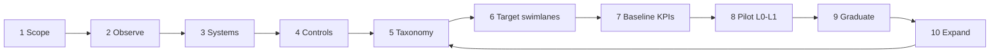

# Process Mapping Methodology — Observe → Expand Responsibility

**Purpose:** A practical 10-step method to map AP work, introduce agents safely, and expand responsibility only when evidence justifies it.

**Principle:** Observation precedes automation. Automation precedes autonomy. Autonomy is earned.

---

## What / How / Who

| Lens | Answer |
|---|---|
| **What** | Move from tribal AP process to governed agent-ready process |
| **How** | 10 steps from observe → stabilize → automate → graduate |
| **Who** | AP Manager (sponsor); Process Analyst; Control Owner; Agent Human Owners |

---

## The 10 steps

### 1. Frame the scope
Define entity, channels, invoice types, currencies, and out-of-scope items (e.g., employee expenses if separate).  
**Template:** Scope Charter (see Templates folder / use section below).  
**Exit:** Written scope signed by AP Manager.

### 2. Observe as-is (Level 0 mindset)
Shadow invoice journeys end-to-end for a representative sample. Capture systems, handoffs, waits, rework. No process redesign yet.  
**Exit:** Journey maps + time/touch estimates (ranges OK).

### 3. Inventory work objects & systems
List objects (invoice, PO, GR, statement, approval, payment proposal) and systems of record vs convenience tools.  
**Exit:** System inventory with SoR flags.

### 4. Map controls & SoD
Document who can create, approve, change vendor bank, propose pay, release pay. Identify gaps.  
**Exit:** Control points map linked to future Agent Control Matrix.

### 5. Build exception taxonomy baseline
Code a sample of historical exceptions into the taxonomy (≥27 categories). Measure volume and $.  
**Reference:** `01_EXCEPTION_TAXONOMY.md`  
**Exit:** Pareto of top codes; data gaps noted.

### 6. Define target process with agent swimlanes
Draw should-be flow with A01–A16 responsibilities and human gates (especially payment auth).  
**Exit:** Target swimlane + RACI per agent.

### 7. Instrument & baseline KPIs
Wire event logging before enabling writes. Capture baseline cycle time, exception rate, cost-to-process inputs.  
**Reference:** `../KPI_Measurement/00_KPI_FRAMEWORK.md`  
**Exit:** Baseline pack (dated).

### 8. Pilot agents at L0→L1
Enable shadow mode, then recommendations. Measure acceptance and errors. No vanity volume goals.  
**Reference:** `../Agent_Library/01_AUTONOMY_PROGRESSION.md`  
**Exit:** Pilot readout with FP/FN and cost.

### 9. Graduate narrowly (L2+)
Promote one agent × one scope band at a time using Graduation Packets. Keep payment auth human.  
**Exit:** Signed packets; A16 policy versions.

### 10. Expand responsibility & industrialize
Add channels/entities; feed A15 root-cause loop; refresh business case with actuals. Re-attest autonomy quarterly.  
**Reference:** `../Business_Case/00_BUSINESS_CASE_MODEL.md`  
**Exit:** Expansion decision record; updated ceilings.

---

## Templates (minimum set)

Use / adapt in `../Templates/`:

| Template | Use in steps |
|---|---|
| Scope Charter | 1 |
| Journey Observation Log | 2 |
| System Inventory | 3 |
| SoD / Control Point Register | 4 |
| Exception Coding Sheet | 5 |
| Target Swimlane + RACI | 6 |
| KPI Baseline Pack | 7 |
| Pilot Scorecard | 8 |
| Autonomy Graduation Packet | 9 |
| Expansion Decision Record | 10 |

### Lightweight field lists

**Scope Charter:** entities, channels, in/out, success metrics, risks, sponsor, date.  
**Graduation Packet:** agent, from→to level, scope, metrics, controls, cost, rollback, signatures.  
**Exception Coding Sheet:** invoice ID, primary code, secondary, $, root hint, coder, date.

---

## What can go wrong

| Failure | Mitigation |
|---|---|
| Automating a broken process | Steps 2–5 before writes |
| Big-bang all 16 agents at L3 | One agent × scope; ceilings |
| No baseline → fake ROI | Step 7 mandatory |
| Taxonomy ignored | Step 5 + ongoing QA |

---

## Control / Measure / Evidence

| Dimension | Standard |
|---|---|
| **Control** | No L2+ without packet; payment auth human |
| **Measure** | Step exit criteria met %; time in L0/L1 |
| **Evidence** | Charters, maps, baselines, packets, A16 diffs |

---

## Related

- Taxonomy: `01_EXCEPTION_TAXONOMY.md`
- Autonomy: `../Agent_Library/01_AUTONOMY_PROGRESSION.md`
- Governance: `../Governance/00_GOVERNANCE_FRAMEWORK.md`
