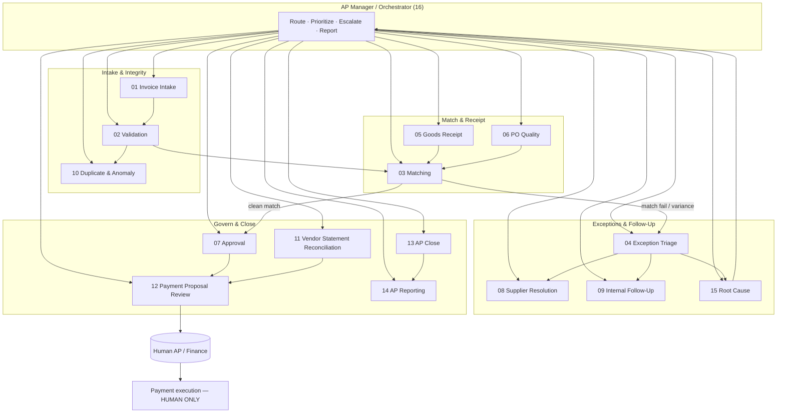

# AP Agent OS Pro — Agent Stack Overview

**Product:** AP Agent OS Pro  
**Scope:** 15 specialist agents + 1 AP Manager (Orchestrator)  
**Design principles:** ERP-agnostic · autonomy earned (not default) · payment stays human · no fraud guarantees · Monday-ready

---

## Purpose

This library defines the operating agents for accounts payable (AP) work. Each agent has a bounded job, explicit exclusions, a human owner, escalation paths, audit evidence, and autonomy rules (Levels 0–4). Agents propose and prepare; humans approve payments and high-risk exceptions.

---

## Stack diagram

---

## Agent roster

| # | Agent | Primary job | Spec file |
|---|--------|-------------|-----------|
| 01 | Invoice Intake | Capture, classify, and register inbound invoices | `01_Invoice_Intake_Agent.md` |
| 02 | Validation | Check completeness, tax, master-data fit, policy | `02_Invoice_Validation_Agent.md` |
| 03 | Matching | 2-/3-way match PO, receipt, invoice | `03_Matching_Agent.md` |
| 04 | Exception Triage | Classify, prioritize, and route exceptions | `04_Exception_Triage_Agent.md` |
| 05 | Goods Receipt | Detect missing/partial GR and prompt receivers | `05_Goods_Receipt_Agent.md` |
| 06 | PO Quality | Flag poor PO data that blocks clean matching | `06_PO_Quality_Agent.md` |
| 07 | Approval | Route and track approvals per matrix | `07_Approval_Agent.md` |
| 08 | Supplier Resolution | Draft and track supplier queries | `08_Supplier_Resolution_Agent.md` |
| 09 | Internal Follow-Up | Chase requesters, receivers, budget owners | `09_Internal_FollowUp_Agent.md` |
| 10 | Duplicate & Anomaly | Detect likely duplicates and outliers | `10_Duplicate_Anomaly_Agent.md` |
| 11 | Vendor Statement Reconciliation | Reconcile statements to open items | `11_Vendor_Statement_Reconciliation_Agent.md` |
| 12 | Payment Proposal Review | Build payment proposals for human approval | `12_Payment_Proposal_Review_Agent.md` |
| 13 | AP Close | Drive period-close checklist and blockers | `13_AP_Close_Agent.md` |
| 14 | AP Reporting | Produce operational and control reports | `14_AP_Reporting_Agent.md` |
| 15 | Root Cause | Analyze recurring exceptions; recommend fixes | `15_Root_Cause_Agent.md` |
| 16 | AP Manager / Orchestrator | Coordinate agents, SLAs, escalations, handoffs | `16_AP_Manager_Orchestrator.md` |

---

## Non-negotiable rules

1. **Payment stays human.** No agent releases, executes, or confirms bank payment.
2. **No fraud guarantees.** Agents surface risk signals; they do not certify fraud-free status.
3. **Autonomy is earned.** Default start is Level 0–1; promotion requires measured quality (see `17_RESPONSIBILITY_PROGRESSION_MODEL.md`).
4. **ERP-agnostic.** Specs reference logical entities (PO, GR, invoice, vendor) not a single ERP product.
5. **Monday-ready.** Every agent has a clear owner, queue, and “what to do first thing Monday” output.

---

## Related documents

| Doc | Path |
|-----|------|
| Responsibility progression | `17_RESPONSIBILITY_PROGRESSION_MODEL.md` |
| Exception taxonomy | `18_EXCEPTION_TAXONOMY.md` |
| Governance | `../Governance/00_AGENT_GOVERNANCE_FRAMEWORK.md` |
| Controls | `../Controls/00_CONTROL_FRAMEWORK.md` |

---

## How to use this library

1. Assign a human owner per agent before go-live.
2. Start each agent at autonomy Level 0 or 1.
3. Wire tools/data to your ERP, inbox, and document store via adapters.
4. Log every material action for audit (see Controls).
5. Promote autonomy only after KPI gates pass for a defined window.
