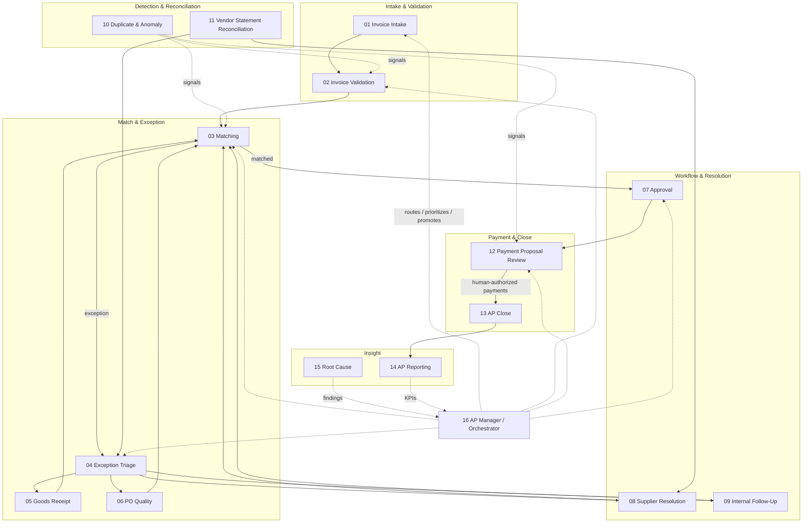

# AP Agent Stack Overview

**Evidence Room — AP Agent OS Pro**  
**Document type:** Architecture charter  
**Audience:** Controllers, AP managers, transformation leads, internal audit  
**Scope:** ERP-agnostic agent operating model for Accounts Payable

---

## 1. Purpose

The AP Agent Stack is a governed set of sixteen specialized agents that support — never replace — the Accounts Payable operating model. Each agent is designed to reduce cycle time, raise evidence quality, and surface exceptions earlier, while preserving human accountability for payment authorization, policy exceptions, and material judgment.

Agents earn responsibility through measured performance. Full autonomy is never the default posture.

---

## 2. Design principles

| Principle | Meaning in practice |
|---|---|
| **Earn, don’t assume** | Every agent starts at Observe or Recommend. Promotion is evidence-based. |
| **ERP-agnostic** | Agents consume normalized AP objects (invoice, PO, receipt, vendor, payment proposal) — not a single vendor’s UI or API quirks. |
| **Human owns the outcome** | Named human owners remain accountable for process results and control effectiveness. |
| **Evidence by default** | Every material action produces auditable artifacts: inputs, decision rationale, outputs, and timestamps. |
| **Narrow charters** | Agents do one job well. Cross-domain work is orchestrated, not improvised. |
| **Fail closed on money movement** | Payment authorization, bank file release, and irreversible postings stay human-gated unless a formal L4 promotion is approved in writing. |

---

## 3. The sixteen-agent architecture

---

## 4. Agent roster (summary)

| # | Agent | Primary job | Typical start level |
|---|---|---|---|
| 01 | Invoice Intake | Capture, classify, and register inbound invoices | L0–L1 |
| 02 | Invoice Validation | Completeness, tax, vendor, and policy checks | L0–L1 |
| 03 | Matching | 2-/3-way match against PO and receipt | L0–L1 |
| 04 | Exception Triage | Classify, prioritize, and route exceptions | L0–L1 |
| 05 | Goods Receipt | Detect missing/late receipts; prepare GR prompts | L0–L1 |
| 06 | PO Quality | Flag weak POs that drive AP failure | L0–L1 |
| 07 | Approval | Assemble packs; route; track SLA — not self-approve | L0–L1 |
| 08 | Supplier Resolution | Draft and track supplier exception correspondence | L0–L1 |
| 09 | Internal Follow-Up | Chase buyers, receivers, and cost centers | L0–L1 |
| 10 | Duplicate & Anomaly | Score duplicate/anomaly risk — **not a fraud guarantee** | L0–L1 |
| 11 | Vendor Statement Reconciliation | Reconcile statements to open items | L0–L1 |
| 12 | Payment Proposal Review | Review proposals; **payment auth remains human** | L0–L1 |
| 13 | AP Close | Checklist, accruals support, close evidence pack | L0–L1 |
| 14 | AP Reporting | Operating dashboards and evidence packs | L0–L1 |
| 15 | Root Cause | Pattern analysis and corrective-action drafts | L0–L1 |
| 16 | AP Manager / Orchestrator | Route work, enforce guardrails, manage promotions | L1 |

---

## 5. Interaction model

### 5.1 Happy path (PO invoice)

1. **01 Intake** registers the invoice and hands a normalized record to **02 Validation**.
2. **02 Validation** confirms structure, vendor master fit, and policy basics; flags issues early.
3. **03 Matching** performs 2-/3-way match; on success, routes to **07 Approval** (if required) then **12 Payment Proposal Review**.
4. **12** prepares a reviewed proposal; a human authorizes payment release.
5. **13 AP Close** consumes period activity for close evidence; **14 Reporting** publishes KPIs.

### 5.2 Exception path

1. Match failure or validation failure enters **04 Exception Triage**.
2. Triage routes to the specialist: **05** (receipt), **06** (PO quality), **08** (supplier), **09** (internal), or back to **02/03** after remediation.
3. **10 Duplicate & Anomaly** may inject holds or review flags at intake, match, or payment proposal stages.
4. **11 Vendor Statement Reconciliation** may create exception work items for **04/08**.

### 5.3 Orchestration plane

**16 AP Manager / Orchestrator** does not process invoices itself. It:

- Prioritizes queues by aging, amount, and SLA risk
- Enforces autonomy ceilings and dual-control rules
- Coordinates handoffs and prevents agent collision (two agents acting on the same invoice without a defined sequence)
- Triggers promotion/demotion reviews with **evidence packs**
- Escalates to the human AP Manager when guardrails are breached

---

## 6. Human oversight points (non-negotiable)

| Control point | Human role | Agent may assist | Agent may not |
|---|---|---|---|
| Payment authorization / bank release | Treasurer / AP Manager / delegated signer | Prepare proposal, highlight exceptions | Authorize or release funds |
| Vendor master bank-detail change | Master-data owner + dual control | Detect anomaly; draft change request | Apply bank changes unilaterally |
| Policy override above threshold | Controller / delegate | Recommend with rationale | Grant material overrides alone |
| Autonomy promotion to L3/L4 | AP Manager + Controller (L4 also Audit) | Assemble performance evidence | Self-promote |
| Write-off / credit memo above threshold | Controller | Prepare journal support | Post without approval |
| Fraud allegation / legal hold | Compliance / Legal | Preserve evidence; freeze processing | Conclude guilt or clear cases alone |

These oversight points are wired into every charter’s **Approval requirements** and **Explicit exclusions**.

---

## 7. Orchestrator role (Agent 16) in detail

The Orchestrator is the operating system’s traffic controller and accountability layer.

**Owns**

- Work routing and queue health
- Autonomy registry alignment (no agent exceeds approved level)
- Cross-agent SLA and collision rules
- Escalation ladders to human owners
- Periodic performance roll-up for promotion boards

**Does not own**

- Invoice correctness (domain agents do)
- Payment release
- Policy writing (Governance owns policy; Orchestrator enforces it)

**Relationship to humans**

The human AP Manager remains the accountable executive for AP outcomes. Agent 16 is a force multiplier with a charter — not a substitute manager.

---

## 8. Data plane (ERP-agnostic)

Agents consume and produce **canonical objects**, mapped once per ERP connector:

| Object | Minimum fields (illustrative) |
|---|---|
| Invoice | ID, vendor, amounts, tax, dates, lines, source channel, attachments |
| Purchase order | PO #, lines, qty/price, requester, status, tolerances |
| Goods receipt | GR #, PO link, qty, date, receiver |
| Vendor | ID, status, payment terms, bank fingerprint hash, tax IDs |
| Payment proposal | Batch ID, invoices, amounts, pay date, hold flags |
| Exception case | Type, severity, owner, aging, linked docs |
| Evidence artifact | Hash, timestamp, actor (human/agent), action, rationale |

Connectors may be SAP, Oracle, NetSuite, Dynamics, or others. Agent logic must not embed ERP-specific navigation assumptions.

---

## 9. Operating cadence

| Cadence | Activity | Owner |
|---|---|---|
| Continuous | Intake → validate → match → triage | Agents 01–09 under Orchestrator |
| Daily | Queue review, SLA breaches, payment proposal prep | Human AP lead + Agent 16/12 |
| Weekly | KPI pack, duplicate/anomaly trends, promotion candidates | Agents 14/10/16 + AP Manager |
| Period-end | Close checklist and evidence pack | Agent 13 + AP Manager / Controller |
| Quarterly | Autonomy board: promote / hold / demote | AP Manager, Controller, Audit |

---

## 10. Related documents

- `RESPONSIBILITY_MODEL.md` — Levels 0–4, promotion, demotion
- `AGENT_01_…` through `AGENT_16_…` — individual charters
- `AGENT_REGISTRY_GUIDE.md` — Excel registry maintenance
- Governance / Controls packs (AP Agent OS Pro) — policy and SOX-aligned controls

---

## 11. One-sentence doctrine

**AP Agent OS multiplies skilled AP teams by making evidence-rich preparation the default — and by requiring humans to remain the final authority on money, master data, and material judgment.**
