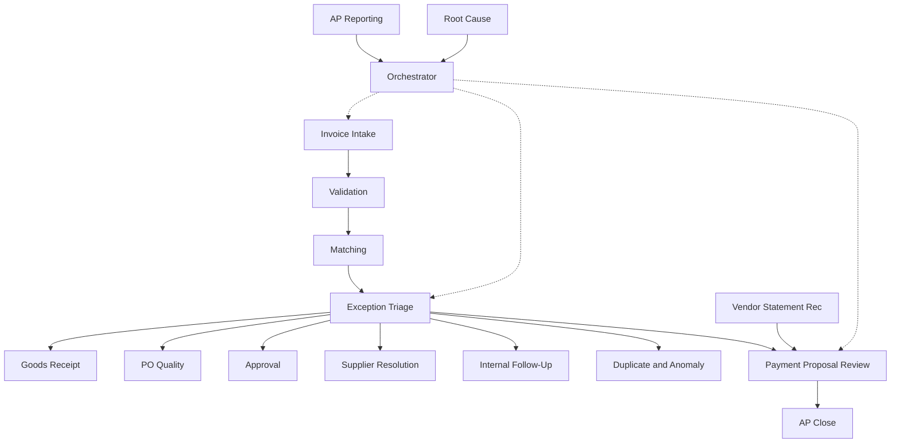

# AP Agent Stack Overview

Sixteen specialised agents plus Orchestrator. ERP-agnostic agent layer across Dynamics 365, SAP, Oracle, NetSuite, Workday and other environments.

Payment authorisation remains human. Autonomy defaults to Level 0/1.
