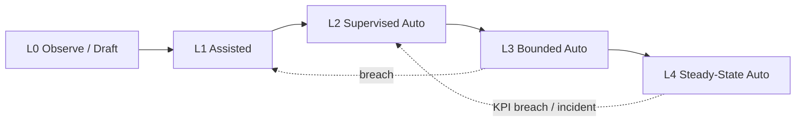

# 17 — Responsibility Progression Model (Autonomy Levels 0–4)

**Product:** AP Agent OS Pro  
**Rule:** Autonomy is **earned**, not default. Payment release remains **human at every level**.

---

## Overview

Each agent starts at Level 0 or 1. Promotion requires measured quality over a defined window, explicit human approval, and registry update in Governance. Demotion is automatic on KPI breach or incident.

---

## Level definitions

| Level | Name | Agent behavior | Human role | Typical use |
|-------|------|----------------|------------|-------------|
| **0** | Observe / Draft | Reads data; prepares worksheets and drafts; **no** production side effects | Does all sends, posts, routing confirms | Week 1 go-live, new entity, high-risk process |
| **1** | Assisted | Runs checks and drafts actions; may write to case system as “proposed” | Confirms every material action before effect | Early production |
| **2** | Supervised automation | Auto-completes **happy path** within strict rules; exceptions to humans | Samples reviews; handles exceptions; releases payments | Mature intake/validate/match |
| **3** | Bounded automation | Handles minor variances / standard chases within $ and code caps | Reviews dashboards; approves edge cases; payments | Stable vendors/categories |
| **4** | Steady-state automation | Broad automation inside policy; continuous monitoring | Governance, exceptions, **all payment releases**, autonomy audits | Only after sustained evidence |

### Permanent ceilings (all levels)

- Payment **execution / bank release** = human only  
- Vendor bank master changes = Master Data SoD  
- Fraud/duplicate **hard-flag clearance** = human Controls/AP Manager  
- Autonomy **promotion** = governance approval  
- No “fraud-free” certification by any agent  

---

## Promotion gates (default)

Apply per agent unless a local charter tightens them.

| From → To | Minimum window | Quality gates (illustrative) | Other |
|-----------|----------------|------------------------------|-------|
| 0 → 1 | 2 weeks | Draft acceptance ≥90%; no critical control incidents | Owner trained; audit logging verified |
| 1 → 2 | 4 weeks | False-auto rate ≤2%; KPI green; sampling 10% OK | Playbooks signed; kill-switch tested |
| 2 → 3 | 6 weeks | Exception reopen ≤5%; $ impact of errors within tolerance | Caps documented; cost within budget |
| 3 → 4 | 8 weeks | Sustained KPIs; external/process owner OK; RCA debt not critical | Board/Controller awareness for material scope |

**Approver for promotion:** Human AP Manager + Controls (for agents 07, 10, 12) + IT security for connector scope changes.

---

## Demotion / freeze triggers

| Trigger | Action |
|---------|--------|
| Critical control incident (wrong pay proposal including hard-flagged item, silent PO edit, etc.) | Freeze to L0/L1 immediately |
| KPI red for 2 consecutive weeks | Drop one level |
| Cost overrun > band without volume | Throttle + review |
| Model/provider change | Freeze at prior level until re-validation |
| Prompt-injection or data-exfil incident | Kill-switch; security review |

---

## Sampling model

| Level | Human sample rate (happy path) |
|-------|--------------------------------|
| 0–1 | 100% material actions |
| 2 | ≥10% or 25 items/week minimum |
| 3 | ≥5% or risk-based |
| 4 | ≥2% continuous + 100% of P1/hard flags |

---

## Monday-ready operating rhythm

1. **Monday:** Review autonomy registry, demotions, kill-switch events.  
2. **Daily:** Orchestrator shows queue health vs level expectations.  
3. **Weekly:** KPI gate review for agents near promotion.  
4. **Monthly:** Governance forum ratifies level changes.

---

## Registry fields (minimum)

- Agent code, current level, prior level  
- Promotion/demotion dates and approvers  
- Caps ($ , taxonomy codes, channels)  
- Kill-switch state  
- Evidence links (KPI reports, sample logs)

---

## Related

- Agent specs: `01`–`16`  
- Governance: `../Governance/00_AGENT_GOVERNANCE_FRAMEWORK.md`  
- Controls: `../Controls/00_CONTROL_FRAMEWORK.md`
